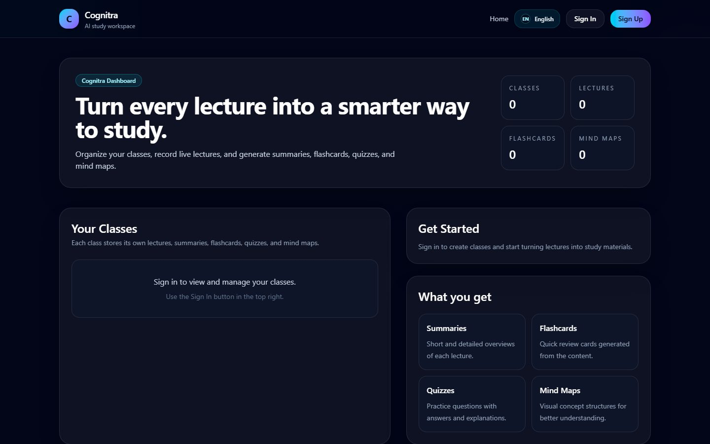

# Cognitra

AI learning workspace that transforms classes, notes, and lecture audio into connected study material.

[Live demo](https://cognitra.vercel.app) · [Portfolio](https://joao-vitor-barros-da-silva-portfoli.vercel.app)



## What it demonstrates

- A multi-feature Next.js 16 product built around a coherent student workflow
- AI-generated flashcards and study material grounded in a learner's notes
- Lecture transcription through a protected server route
- Interactive mind maps with React Flow
- Firebase authentication and cloud-backed user data
- English and Portuguese localization

## Product workflow

```text
Create class -> capture notes or lecture audio -> transcribe and organize
             -> connect concepts -> generate study material -> review
```

## Stack

- Next.js 16, React 19, Tailwind CSS 4
- Firebase authentication and data services
- OpenAI and LangChain
- AssemblyAI transcription
- React Flow visualization
- i18next localization

## Run locally

Requirements: Node.js 20+.

```bash
npm install
cp .env.example .env.local
npm run dev
```

If `.env.example` is not present in your checkout, create `.env.local` with the Firebase public web configuration plus server-only `OPENAI_API_KEY` and `ASSEMBLYAI_API_KEY` values. Never expose server API keys through `NEXT_PUBLIC_` variables.

Open <http://localhost:3000>.

## Environment variables

```text
NEXT_PUBLIC_FIREBASE_API_KEY
NEXT_PUBLIC_FIREBASE_AUTH_DOMAIN
NEXT_PUBLIC_FIREBASE_PROJECT_ID
NEXT_PUBLIC_FIREBASE_STORAGE_BUCKET
NEXT_PUBLIC_FIREBASE_MESSAGING_SENDER_ID
NEXT_PUBLIC_FIREBASE_APP_ID
OPENAI_API_KEY
ASSEMBLYAI_API_KEY
```

## Verification

```bash
npm run lint
npm run build
```

Audio uploaded in the class workspace is processed by `/api/transcribe`, which sends it to AssemblyAI for transcription features such as language detection, speaker labels, chapters, and highlights.

## Project structure

```text
src/app/          Routes and server endpoints
src/components/   Product and interface components
src/lib/          Firebase configuration and utilities
docs/preview.jpg  Recruiter-facing product preview
```
